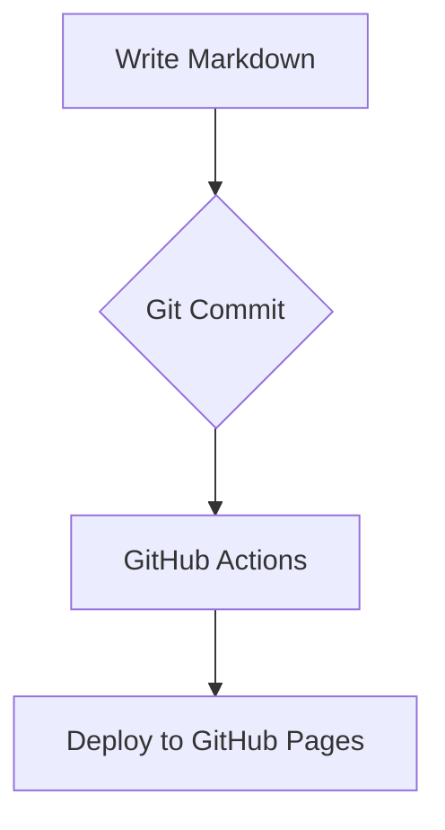

# Boostra Documentation Portal

Welcome to the internal technical documentation portal, built with the **Doc-as-Code** approach: all documentation lives in Markdown files next to the code and is versioned in Git.

[Getting started](getting-started.md){ .md-button .md-button--primary }

## Publishing workflow

The platform is built on MkDocs with the Material for MkDocs theme. Build and deploy are automated via CI/CD following DocOps principles.
