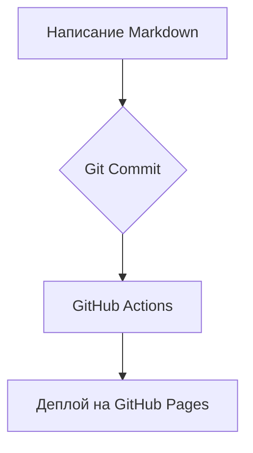

# Портал документации Boostra

Добро пожаловать на внутренний портал технической документации, собранный по методологии **Doc-as-Code**: вся документация хранится в Markdown-файлах рядом с кодом и версионируется в Git[^1].

[Быстрый старт](getting-started.md){ .md-button .md-button--primary }
[Спецификации](specs/2026-07-27-application-flow-coverage-visualization.md){ .md-button }

## Что здесь есть

!!! tip "Возможности портала"
    - 🔍 Полнотекстовый поиск (рус/англ)
    - 🌓 Светлая и тёмная темы
    - 📊 Диаграммы Mermaid.js
    - 📖 Централизованный глоссарий с всплывающими подсказками
    - 🗂 Версионирование документации (mike)
    - 🖨 Экспорт в PDF

## Как устроен процесс публикации

Платформа построена на MkDocs и теме Material for MkDocs. Процессы сборки и деплоя автоматизированы через CI/CD по принципам DocOps.

## С чего начать

1. Откройте раздел [Быстрый старт](getting-started.md).
2. Добавляйте свои `.md` файлы в папку `docs/` и прописывайте их в `nav` внутри `mkdocs.yml`.
3. Запускайте локальный предпросмотр командой `mkdocs serve`.

[^1]: Doc-as-Code — методология ведения документации в текстовых файлах Markdown с версионированием в Git.
