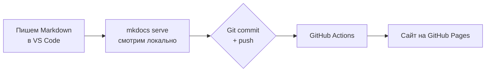

# Демо-портал документации

Это **учебный портал** для освоения процесса **Doc-as-Code**: документация пишется в Markdown, смотрится локально и публикуется автоматически. Реальные данные организации сюда не попадают — всё содержимое вымышленное.

!!! info "Что это и зачем"
    Портал — тестовая песочница. На нём отрабатывается процесс: *редактирование в редакторе → локальный предпросмотр → публикация*. В качестве примера — техническое задание (ТЗ) вымышленного проекта **«ТаскТрекер»**.

[Открыть демо-ТЗ](tz/index.md){ .md-button .md-button--primary }
[Быстрый старт по работе с порталом](getting-started.md){ .md-button }

## Демо-проект «ТаскТрекер»

Простой сервис управления задачами. На его примере показано, как оформлять ТЗ по трём направлениям:

| Раздел | Что внутри |
|---|---|
| [Бэкенд](tz/backend.md) | Архитектура, REST API, бизнес-логика, диаграмма последовательности |
| [Фронтенд](tz/frontend.md) | Экраны, компоненты, пользовательские сценарии, навигация |
| [База данных](tz/database.md) | Схема, ER-диаграмма, таблицы, индексы |

## Как устроен процесс публикации

## С чего начать

1. Открой [Быстрый старт](getting-started.md) — как запускать и редактировать портал.
2. Посмотри, как устроено [демо-ТЗ](tz/index.md).
3. Попробуй сам изменить любой `.md` файл и увидеть результат в браузере.

!!! tip "Эта строка добавлена через ревью"
    Правка попала на сайт не напрямую, а через процесс: ветка → Pull Request → авто-проверки (орфография и сборка) → merge → авто-деплой. Именно так работает командная документация.
