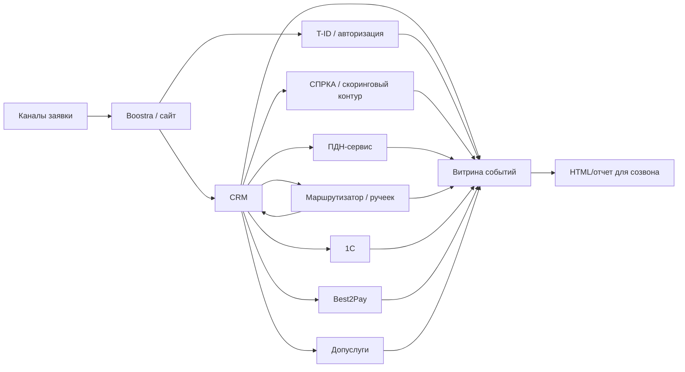
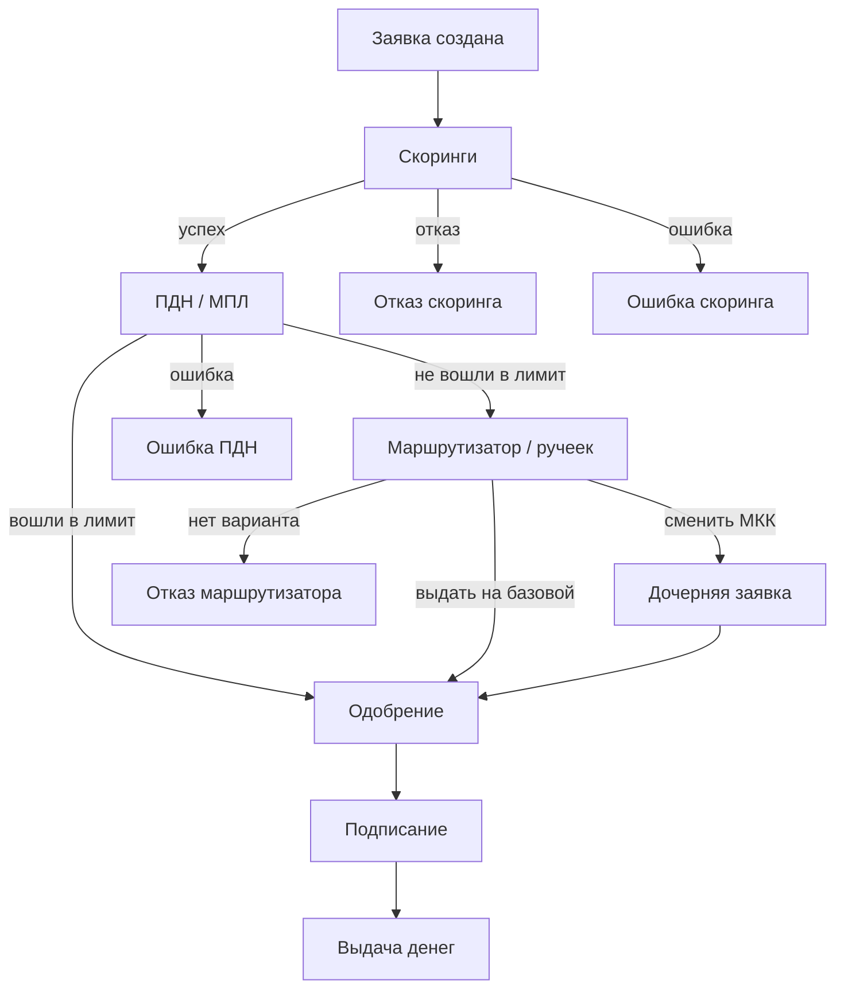
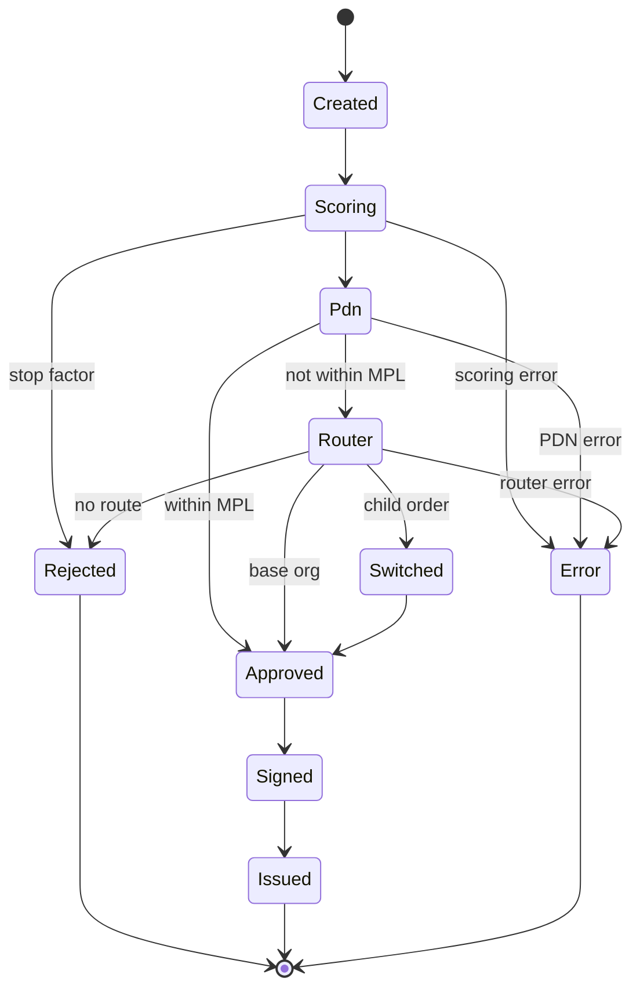

# Анализ и визуализация потока заявок Boostra — спецификация MVP

| Поле | Значение |
|------|----------|
| Дата | 2026-07-27 |
| Статус | Draft |
| Целевой срок MVP | до четверга, 2026-07-30 |
| Автор | системный аналитик |
| Участники | Иван, Эмиль, Бексултан |
| Основание | встреча 2026-07-27, задача Димы Буркова на покрытие и визуализацию прохождения заявок |
| Актуализировано по прототипу | `C:\Users\MSI\Downloads\boostra-zayavka-flow-v2.html` |
| Срез данных в v2 | 2026-07-01..2026-07-27, выгрузка 2026-07-27 |

## 1. Контекст и цель

### 1.1 Что требуется

Нужно разработать рабочий контур анализа и визуализации прохождения заявок за выбранный период. Система должна показывать, как заявки проходят через цепочку систем и этапов:

- создание заявки;
- скоринговый контур / СПРКА;
- расчет ПДН и МПЛ;
- маршрутизатор / "ручеек";
- одобрение;
- подписание;
- выдача денег;
- отказ;
- техническая ошибка или зависание.

Основная цель до 2026-07-30 — подготовить MVP для созвона со Швейхман: не полноценную промышленную систему, а проверяемый отчет/прототип, по которому можно объяснить цифры и показать путь конкретной заявки.

### 1.2 Бизнес-цель

Дать руководителю и команде прозрачный ответ на вопросы:

- сколько заявок было создано за период;
- сколько денег дошло до одобрения, подписания и выдачи;
- где заявки отваливаются;
- какие отказы связаны с регуляторными ограничениями;
- какие заявки потеряны из-за технических ошибок или зависаний;
- как конкретная заявка прошла по системам и почему получила итоговый исход.

### 1.3 Текущее состояние

Есть обновленный HTML-прототип `C:\Users\MSI\Downloads\boostra-zayavka-flow-v2.html`. В отличие от первой версии, v2 уже содержит встроенный объект `window.FLOW_DATA` с обезличенными агрегатами из выгрузок `s_scorings`, `s_orders`, `s_tbank_id`, `s_dop_licenses` за июль 2026. Это полезный демо-снимок для созвона, но не промышленный источник истины: SQL/скрипт генерации `FLOW_DATA` нужно сохранить рядом с отчетом, чтобы каждую цифру можно было воспроизвести.

Фактические показатели, зафиксированные в v2:

| Блок | Значение в прототипе v2 | Комментарий |
|------|--------------------------|-------------|
| Период данных | 2026-07-01..2026-07-27 | выгрузка 2026-07-27 |
| Заявки `s_orders` | 432 645 | агрегат по созданным заявкам за период |
| Выдано | 39 265 | требует сверки с `status=10`, где в v2 отдельно видно 39 238 |
| Запрошенная сумма | 8 484 004 780 ₽ | `orders.amtSum` |
| Сэмпл трекера | ~1 215 обезличенных заявок | до 45 заявок в день, в UI отображается ограниченный список |
| Строки скоринга | 2 263 777 | агрегат `s_scorings` |
| Заявки со скорингом | 419 224 | distinct `order_id` из `s_scorings` |
| T-ID | 17 382 | агрегат `s_tbank_id` |
| СМЭВ T-ID | VALID 8 264, UNVALID 353, empty 8 765 | использовать как KPI авторизации/СМЭВ |
| Допуслуги | 98 967 лицензий, 324 856 956 ₽ | агрегат `s_dop_licenses` |

Новые вкладки и блоки v2, которые надо учитывать в MVP:

- `Финансы` — модель стоимости СПРКА, тариф 41,84 ₽ на заявку со скорингом, прогноз оптимизации Q3;
- `Авторизация` — T-ID и СМЭВ по `s_tbank_id`;
- `Трекер` — реальные обезличенные заявки из выборки, фильтры по дате, ID/UID, UTM и исходу;
- `Выдача` — текущий канал выдачи обозначен как Best2Pay, legacy-ветка Tinkoff не активна;
- `Безопасность` — в исходных CSV есть PII, в HTML должны попадать только обезличенные поля.

Подтвержденные локальные источники в кодовой базе:

- `boostra-develop/api/Orders.php` — статусы заявки, создание, смена статуса, запись `s_order_status_logs`;
- `boostra-develop/api/Scorings.php` и `crm-develop/crm-develop/api/Scorings.php` — типы и статусы скорингов;
- `crm-develop/crm-develop/api/PdnCalculation.php` — расчет ПДН, вызовы сервиса ПДН, признаки финального расчета;
- `crm-develop/crm-develop/api/OrderOrgSwitch.php` — маршрутизатор / ручеек, причины остановок и смена организации;
- `s_tbank_id` — T-ID/СМЭВ-результаты авторизации;
- `s_dop_licenses` — допуслуги и суммы лицензий;
- `boostra-develop/scripts/migrations/0000_baseline_migration.sql` — структура таблиц `s_orders`, `s_order_status_logs`, `s_scorings`, `s_scoring_body`, `s_pdn_calculation`, `s_order_org_switch`.

## 2. Scope MVP

### 2.1 Входит в MVP до 2026-07-30

- Выбор периода дат `date_from` / `date_to`.
- Основной режим анализа: заявки, созданные в периоде по `s_orders.date`.
- Дополнительный режим: заявки, созданные до периода, но имевшие события внутри периода.
- Общая воронка по заявкам.
- Покрытие деньгами: создано, одобрено, подписано, выдано, потеряно.
- Покрытие регуляторкой: ПДН, МПЛ, самозапрет, банкротство, КИ/ФССП/террор/паспортные стопы.
- Покрытие ошибками: ошибки скорингов, ошибки ПДН, ошибки ручейка, зависшие заявки.
- Финансовая вкладка: стоимость скорингового контура по тарифной модели, прогноз оптимизации и отделение этой модели от бухгалтерского бюджета/счетов.
- Авторизация: агрегаты T-ID/СМЭВ по `s_tbank_id`.
- Дополнительные услуги: количество, сумма и статус лицензий по `s_dop_licenses`.
- Детальный таймлайн одной заявки.
- Обезличенный трекер заявок: фильтры по дате, ID/UID, UTM, исходу.
- Список открытых мест, где данных недостаточно или требуется уточнить источник.

### 2.2 Не входит в MVP

- Промышленная BI-система с правами доступа и расписанием обновления.
- Реалтайм-мониторинг.
- Изменение бизнес-логики скорингов, ПДН, ручейка или выдачи.
- Исправление найденных ошибок в продуктивном коде.
- Автоматическое принятие решений по заявкам.
- Вывод персональных данных клиентов в демо-отчете.
- Полная бухгалтерская сверка тарифной модели со счетами провайдеров.
- Вывод сырых CSV-выгрузок в HTML/демо, если в них есть ФИО, телефон, паспорт, адрес, email или другие PII.

## 3. Правила периода

### 3.1 Основной режим: когорта по созданию

Основной отчет строится по заявкам, созданным в выбранный период:

```sql
s_orders.date >= :date_from
AND s_orders.date < :date_to_plus_1_day
```

Для этих заявок показывается весь известный путь, даже если отдельные события произошли после конца периода.

Пример: заявка создана 2026-07-27, а выдана 2026-07-28. В отчете за 2026-07-27 она входит в когорту созданных 27 июля, а событие выдачи показывается в ее таймлайне.

### 3.2 Дополнительный режим: активность внутри периода

Отдельно показываются заявки, созданные до `date_from`, но имевшие события внутри периода:

- смена статуса в `s_order_status_logs.date_added`;
- скоринг в `s_scorings.created`, `start_date`, `end_date`;
- расчет ПДН в `s_pdn_calculation.date_create`;
- запуск/завершение ручейка в `s_order_org_switch.created_at`, `start_date`, `end_date`;
- выдача/подписание/отказ по датам заявки.

Эти заявки не смешиваются с основной когортой, чтобы не искажать конверсию созданных заявок.

### 3.3 Обязательное правило отображения

В каждом отчете должно быть явно написано, какой режим выбран:

- `Когорта по дате создания`;
- `Активность этапов внутри периода`;
- `Смешанный режим запрещен для итоговой конверсии`.

## 4. Основные сущности

### 4.1 Заявка

Ключевая сущность: заявка из `s_orders`.

Основные поля:

- `id` — внутренний ID заявки;
- `order_uid` — UID заявки;
- `user_id` — клиент;
- `date` — дата создания заявки;
- `status` — текущий статус;
- `1c_status` — статус 1С;
- `amount` — запрошенная сумма;
- `approve_amount` — одобренная сумма;
- `loan_type` — тип продукта;
- `organization_id` — МКК;
- `utm_source` / канал — источник заявки для группировки потока;
- `first_loan` — признак первичной/повторной заявки, если доступен в выгрузке;
- `reason_id` — причина отказа;
- `approve_date`, `reject_date`, `accept_date`, `confirm_date`, `payment_date` — ключевые даты.

### 4.2 Событие заявки

Для визуализации все источники приводятся к единой модели события:

| Поле | Тип | Описание |
|------|-----|----------|
| `order_id` | int | ID заявки |
| `order_uid` | string | UID заявки |
| `root_order_id` | int/null | Родительская заявка, если была смена организации |
| `event_time` | datetime | Время события |
| `stage` | string | Нормализованный этап |
| `system` | string | CRM, Boostra, СПРКА, ПДН, Ручеек, 1С, платежный сервис |
| `status` | string/int | Технический статус источника |
| `result` | string | Нормализованный результат: success, reject, error, wait, skipped |
| `reason_id` | int/null | ID причины отказа |
| `reason_text` | string/null | Человекочитаемая причина |
| `amount` | decimal/null | Сумма заявки |
| `approve_amount` | decimal/null | Одобренная сумма |
| `organization_id` | int/null | МКК на момент события |
| `source_table` | string | Таблица-источник |
| `source_id` | string/int | ID строки-источника |
| `details_json` | json/null | Детали для drill-down |

### 4.3 Нормализованные этапы

| Этап | Код | Основные источники |
|------|-----|--------------------|
| Создание заявки | `created` | `s_orders.date` |
| Статус заявки | `order_status` | `s_order_status_logs` |
| Скоринг | `scoring` | `s_scorings`, `s_scoring_body`, `s_scoring_types` |
| ПДН/МПЛ | `pdn` | `s_pdn_calculation` |
| Маршрутизатор/ручеек | `router` | `s_order_org_switch`, `s_order_data` |
| Одобрение | `approved` | `s_orders.approve_date`, статус 2 |
| Подписание | `signed` | `s_orders.accept_date`, статус 8 |
| Выдача | `issued` | `s_orders.confirm_date`, статус 10, платежные таблицы |
| Отказ | `rejected` | `s_orders.reject_date`, статус 3, `reason_id` |
| Ошибка | `error` | `s_scorings.status=5`, `s_order_org_switch.status=ERROR`, ошибки ПДН |
| Ожидание/зависание | `wait` | статусы 18/19/20, WAIT/PROCESS без завершения |

## 5. Источники данных

### 5.1 Матрица источников

| Источник | Что дает | Ключ связи | Поле времени | Что важно проверить |
|----------|----------|------------|--------------|---------------------|
| `s_orders` | заявка, суммы, текущий статус, ключевые даты | `id`, `order_uid`, `user_id` | `date`, `approve_date`, `reject_date`, `accept_date`, `confirm_date` | какие статусы считать финальными |
| `s_order_status_logs` | история смен статусов CRM/1С | `order_id` | `date_added` | не все смены могут иметь бизнес-причину |
| `s_scorings` | очередь и результат скорингов | `order_id`, `user_id` | `created`, `start_date`, `end_date` | типы 1, 17, 18, 34, 35 и прочие стоп-факторы |
| `s_scoring_body` | тело ответа скоринга | `scoring_id` | нет | JSON может быть большим и разным по структуре |
| `s_scoring_types` | название, `negative_action` | `id = s_scorings.type` | нет | какие скоринги реально стопят заявку |
| `s_pdn_calculation` | ПДН, МПЛ, запрос/ответ ПДН | `order_id`, `order_uid` | `date_create` | брать последний успешный или финальный расчет |
| `s_order_org_switch` | ручеек, новая заявка, причина | `order_id`, `new_order_id` | `created_at`, `start_date`, `end_date` | связывать родительскую и дочернюю заявку |
| `s_order_data` | флаги ручейка/ПДН/продукта | `order_id` | нет | ключи хранятся как key-value |
| `s_tbank_id` | T-ID, результат СМЭВ | `user_id`, потенциально связь с заявкой через пользователя | требует подтверждения | поле `sub` пишется, но в коде не используется для чтения; проверить дату события |
| `s_dop_licenses` | допуслуги, статус, сумма лицензии | требует подтверждения: `order_id`/`user_id`/договор | требует подтверждения | в `api_body` есть PII, в витрину не выводить |
| Best2Pay / `s_p2pcredit` / платежные таблицы | факт выдачи и ошибка платежа | `order_id`, `contract_id` | зависит от таблицы | в v2 текущий канал указан как Best2Pay; legacy Tinkoff-ветка выключена |
| `window.FLOW_DATA` в HTML v2 | демо-агрегаты и обезличенный сэмпл | уже сгенерированный JSON | `meta.dateMin`, `meta.dateMax`, дата файла | не источник истины; нужен SQL/скрипт генерации |

### 5.2 Предварительная классификация систем

| Система | Что считать событием |
|---------|----------------------|
| Boostra site/main | создание заявки, авторизация, подписание |
| CRM | скоринги, статусы, автоподтверждение, ручеек, выдача |
| СПРКА / скоринговый контур | строки `s_scorings`, результаты `success/status/string_result/body` |
| ПДН-сервис | строки `s_pdn_calculation`, `pti_percent`, `is_within_mpl`, ошибки |
| Маршрутизатор / ручеек | `s_order_org_switch`, результат, новая заявка |
| 1С | `1c_status`, UID, синхронизация заявки и статусов |
| Авторизация / T-ID | `s_tbank_id`, СМЭВ VALID/UNVALID/empty |
| Допуслуги | `s_dop_licenses`, статус SUCCESS/ERROR, тип услуги, сумма |
| Платежный контур | Best2Pay как текущий канал выдачи; Tinkoff/T-Bank рассматривать только как legacy или будущую интеграцию после подтверждения |

## 6. Функциональные требования

### FR-1: Выбор периода анализа

**Как:** руководитель или аналитик хочет выбрать период дат, чтобы увидеть заявки и события за этот период.  

**Критерии приемки:**

- [ ] Пользователь задает `date_from` и `date_to`.
- [ ] В основном режиме список заявок фильтруется по `s_orders.date`.
- [ ] В интерфейсе или отчете явно указано, что выбран режим "когорта по дате создания".
- [ ] Период включает весь день `date_to`, а не только `00:00:00`.

**Edge cases:**

- `date_from = date_to` — отчет строится за один день.
- Заявка создана в конце дня, а обработана на следующий день — заявка остается в когорте дня создания.

**Исключено из scope:** выбор периода по дате выдачи как основной режим.

### FR-2: Отдельный режим активности внутри периода

**Как:** аналитик хочет видеть заявки, созданные раньше, но проходившие этапы внутри периода, чтобы не потерять нагрузку на системы.  

**Критерии приемки:**

- [ ] Есть отдельная выборка "активные в период".
- [ ] В нее попадают заявки с событиями в периоде по таблицам событий.
- [ ] Такие заявки не прибавляются к основной когорте созданных заявок.
- [ ] Отчет показывает количество таких заявок отдельно.

**Edge cases:**

- Заявка создана до периода, но выдана внутри периода.
- Заявка создана до периода, но получила отказ внутри периода.
- Заявка создана до периода, но только зависла в PROCESS без финального события.

**Исключено из scope:** смешивание двух режимов в единую конверсию.

### FR-3: Построение сквозного таймлайна заявки

**Как:** аналитик хочет открыть конкретную заявку и увидеть последовательность событий, чтобы объяснить итоговый результат.  

**Критерии приемки:**

- [ ] По `order_id` строится отсортированный по времени таймлайн.
- [ ] В таймлайне указаны этап, система, статус, результат и источник.
- [ ] Для отказа показаны `reason_id` и текст причины, если доступен.
- [ ] Для скоринга показаны тип, статус, `success`, `string_result`.
- [ ] Для ПДН показаны `pti_percent`, `is_within_mpl`, `success`, признак финального расчета.
- [ ] Для ручейка показаны `status`, `result`, `new_order_id`, `source`.
- [ ] В трекере есть фильтры по дате создания, `order_id`/`order_uid`, UTM-каналу и исходу.
- [ ] В интерфейсе явно показано, что детальный список v2 — это сэмпл, а не вся генеральная совокупность.
- [ ] Если UI ограничивает выдачу первыми 300 строками, это ограничение показано пользователю.

**Edge cases:**

- У заявки несколько ПДН-расчетов.
- У заявки несколько скорингов одного типа.
- У заявки есть дочерняя заявка после смены организации.
- События имеют одинаковое время.

**Исключено из scope:** отображение полных персональных данных клиента.

### FR-4: Воронка прохождения заявок

**Как:** руководитель хочет видеть агрегированную воронку, чтобы понять, где теряется поток.  

**Критерии приемки:**

- [ ] Показано количество созданных заявок.
- [ ] Показано количество заявок, дошедших до скоринга.
- [ ] Показано количество заявок, прошедших ключевые скоринги.
- [ ] Показано количество заявок с ПДН-расчетом.
- [ ] Показано количество заявок, прошедших ручеек.
- [ ] Показано количество одобренных, подписанных и выданных.
- [ ] Показано количество отказанных и ошибочных.

**Edge cases:**

- Заявка отказана до скоринга.
- Заявка одобрена без полного набора ожидаемых событий.
- Заявка выдана после конца выбранного периода.

**Исключено из scope:** прогнозирование будущей конверсии.

### FR-5: Покрытие деньгами

**Как:** руководитель хочет видеть денежное покрытие, чтобы понимать финансовый эффект отказов и ошибок.  

**Критерии приемки:**

- [ ] Посчитана сумма заявок по `s_orders.amount`.
- [ ] Посчитана сумма одобрений по `approve_amount` или подтвержденному правилу расчета.
- [ ] Посчитана сумма подписанных заявок.
- [ ] Посчитана сумма выданных заявок.
- [ ] Посчитана сумма заявок, потерянных на отказах.
- [ ] Посчитана сумма заявок, потерянных на ошибках/зависаниях.
- [ ] Для каждой суммы указано, из какого поля она взята.
- [ ] Отдельно показана запрошенная сумма из v2: 8 484 004 780 ₽ за 2026-07-01..2026-07-27.
- [ ] Денежная воронка заявок не смешивается с моделью стоимости скорингов и бюджетом провайдеров.

**Edge cases:**

- `approve_amount` пустой.
- Сумма менялась после создания заявки.
- Исходная заявка отказана из-за смены организации, но дочерняя выдана.

**Исключено из scope:** бухгалтерская сверка с 1С и платежными реестрами.

### FR-6: Покрытие регуляторкой

**Как:** аналитик хочет выделить регуляторные стопы, чтобы отделить бизнес-отказы от обязательных ограничений.  

**Критерии приемки:**

- [ ] Отдельно показаны отказы по ПДН.
- [ ] Отдельно показаны заявки, не вошедшие в МПЛ.
- [ ] Отдельно показаны самозапреты.
- [ ] Отдельно показаны банкротства.
- [ ] Отдельно показаны паспортные/террористические/ФССП/КИ стопы, если они доступны в скорингах.
- [ ] Для каждого типа указаны `reason_id`, тип скоринга или источник.

**Edge cases:**

- Регуляторный признак есть в скоринге, но итоговый отказ записан другой причиной.
- ПДН был рассчитан несколько раз с разными результатами.
- Ручеек перевел заявку на другую организацию вместо отказа.

**Исключено из scope:** юридическая трактовка правомерности отказа.

### FR-7: Покрытие ошибками

**Как:** команда хочет видеть технические потери, чтобы понимать, где заявка не получила бизнес-решение из-за системы.  

**Критерии приемки:**

- [ ] Показаны скоринги со статусом `ERROR`.
- [ ] Показаны ПДН-расчеты с ошибкой или некорректным результатом.
- [ ] Показаны записи ручейка со статусом `ERROR`, `NOT_RUN` или долгим `PROCESS`.
- [ ] Показаны заявки в промежуточных статусах без финального события дольше заданного порога.
- [ ] Для ошибки указан источник и техническое сообщение, если оно доступно.

**Edge cases:**

- Скоринг сначала был `ERROR`, потом успешно перезапущен.
- Ручеек не запускался по бизнес-причине, а не из-за ошибки.
- Заявка зависла, но позже обработалась после построения отчета.

**Исключено из scope:** автоматическое исправление ошибок.

### FR-8: Связь родительской и дочерней заявки при смене организации

**Как:** аналитик хочет видеть исходную и дочернюю заявку как один бизнес-путь, чтобы не считать смену организации ложным отказом.  

**Критерии приемки:**

- [ ] По `s_order_org_switch.order_id` и `new_order_id` строится связь.
- [ ] Исходная заявка с `REASON_SWITCH_ORGANIZATION` не считается потерей, если дочерняя заявка выдана.
- [ ] В таймлайне показан момент смены организации.
- [ ] В агрегатах можно отдельно увидеть "выдано после смены организации".

**Edge cases:**

- Дочерняя заявка не создалась.
- Дочерняя заявка создана, но отказана.
- Есть повторные попытки ручейка или перезапуск.

**Исключено из scope:** изменение механики ручейка.

### FR-9: Экспорт/демо для созвона

**Как:** команда хочет показать результат на созвоне, чтобы быстро обсудить проблемы и решения.  

**Критерии приемки:**

- [ ] Есть HTML/табличный отчет с агрегатами.
- [ ] Есть список заявок и фильтр по номеру.
- [ ] Есть минимум 3-5 реальных обезличенных кейсов для демонстрации.
- [ ] В отчете нет ФИО, телефона, паспорта, ИНН и других персональных данных.
- [ ] Все ключевые цифры можно объяснить SQL-источником.

**Edge cases:**

- По некоторым заявкам не хватает данных для полного таймлайна.
- Данные в источниках противоречат друг другу.

**Исключено из scope:** публикация отчета для широкого круга пользователей.

### FR-10: Финансовая модель стоимости скорингового контура

**Как:** руководитель хочет видеть стоимость проверок СПРКА и эффект оптимизации провайдеров, чтобы отделить операционные потери заявок от расходов на принятие решений.  

**Критерии приемки:**

- [ ] Показан тариф модели СПРКА: 41,84 ₽ на заявку со скорингом.
- [ ] База расчета — `scoring.scoredApps`, то есть distinct `order_id` из `s_scorings`; в v2 это 419 224 заявки.
- [ ] Общая модельная стоимость считается как `41,84 * scoring.scoredApps`; для v2 это около 17,5 млн ₽.
- [ ] В тарифной структуре отдельно показаны Скориста, IDX, НБКИ кредитный отчет, НБКИ ССП, НБКИ самозапрет, СМЭВ Best2Pay и прочие провайдеры.
- [ ] Показан прогноз оптимизации Q3: отключение/замена провайдеров, целевой тариф около 27,42 ₽ на заявку, потенциальная экономия около 14,42 ₽ на заявку.
- [ ] В интерфейсе есть пояснение, что модель по заявкам не равна полному бюджету по счетам провайдеров.

**Edge cases:**

- По IDX возможны ретраи, поэтому фактическое число внешних вызовов может быть больше числа заявок.
- FSSP/Yuristo, FPS и JuicyScore могут быть в тарифной модели, но фактически отключены в продуктиве.
- Полный бюджет по счетам провайдеров может быть около 34,6 млн ₽ в месяц и должен сверяться отдельно.

**Исключено из scope:** бухгалтерская сверка каждого счета и акта провайдера.

### FR-11: Дополнительные услуги

**Как:** руководитель хочет видеть объем и сумму допуслуг, чтобы понимать отдельный финансовый слой, не смешивая его со стоимостью скоринга.  

**Критерии приемки:**

- [ ] По `s_dop_licenses` показаны количество лицензий, сумма и распределение по типам услуг.
- [ ] Для v2 зафиксирован агрегат: 98 967 лицензий, 324 856 956 ₽.
- [ ] Отдельно показаны статусы SUCCESS/ERROR; в v2 SUCCESS 98 964, ERROR 3.
- [ ] В отчете не отображается `api_body`, ФИО, паспорт, телефон, email, номер договора и другие PII.
- [ ] Допуслуги отображаются как отдельный финансовый блок, а не как стоимость скоринга или выдачи.

**Edge cases:**

- У одной заявки может быть несколько лицензий разных типов.
- Статус лицензии может отличаться от итогового статуса заявки.
- Сумма допуслуги может быть связана с договором, а не только с заявкой.

**Исключено из scope:** юридическая проверка условий продажи допуслуг.

### FR-12: Авторизация T-ID и СМЭВ

**Как:** аналитик хочет видеть прохождение авторизации и СМЭВ, чтобы отделить входной технический контур от последующих отказов скоринга и ПДН.  

**Критерии приемки:**

- [ ] По `s_tbank_id` показано количество записей T-ID; в v2 это 17 382.
- [ ] Отдельно показаны результаты СМЭВ: VALID, UNVALID, empty/нет результата.
- [ ] Для v2 зафиксированы значения: VALID 8 264, UNVALID 353, empty 8 765.
- [ ] В отчете указано, как T-ID связывается с заявкой: напрямую или через `user_id`.
- [ ] Отмечено ограничение: поле `sub` пишется, но в текущем коде не используется как читаемый источник флоу.

**Edge cases:**

- У клиента может быть T-ID событие без заявки в выбранной когорте.
- Дата T-ID может не совпадать с датой создания заявки.
- empty-результат СМЭВ нужно классифицировать отдельно от UNVALID.

**Исключено из scope:** изменение авторизационного флоу.

### FR-13: Обезличивание и безопасность выгрузок

**Как:** команда хочет показать реальные данные на созвоне, не раскрывая персональные данные клиентов.  

**Критерии приемки:**

- [ ] В HTML/отчете нет ФИО, телефона, email, адреса, паспорта, ИНН, банковских карт и полного тела внешних API.
- [ ] Из `s_orders` не выводятся `name`, `address`, `phone`, `email`, `ip`.
- [ ] Из `s_dop_licenses` не выводится `api_body`, потому что там могут быть ФИО, паспорт, телефон, email и номер договора.
- [ ] Для демо используются только `order_id`, `order_uid`, даты, статусы, суммы, UTM, тип продукта, организация и технические признаки.
- [ ] Сырые CSV/SQL-выгрузки с PII хранятся отдельно от демо и доступны только ограниченному кругу.

**Edge cases:**

- `string_result` и тексты ошибок могут случайно содержать клиентские данные или внешние идентификаторы.
- UID заявки можно показывать, но нельзя добавлять поля, позволяющие восстановить клиента.
- Скриншоты прототипа не должны содержать PII из браузерной консоли или debug-блоков.

**Исключено из scope:** построение полноценной ролевой модели доступа до 2026-07-30.

## 7. Нефункциональные требования

| Категория | Требование | Метрика | Приоритет |
|-----------|------------|---------|-----------|
| Производительность | Отчет за 1 день должен строиться в приемлемое время | до 60 секунд на MVP-выгрузку | Высокий |
| Производительность | Детальный таймлайн одной заявки должен открываться быстро | до 5 секунд по `order_id` | Средний |
| Надежность | Все агрегаты должны иметь источник и правило расчета | 100% ключевых метрик с указанием таблицы/поля | Высокий |
| Надежность | `window.FLOW_DATA` должен воспроизводиться из SQL/скрипта | сохранен генератор и версия входных выгрузок | Высокий |
| Надежность | Каждый демо-снимок должен иметь метаданные периода и даты генерации | `dateMin`, `dateMax`, дата выгрузки, список источников | Высокий |
| Безопасность | В демо не выводить PII | 0 полей ФИО/телефон/паспорт/ИНН в итоговом HTML/отчете | Высокий |
| Безопасность | Сырые CSV с PII не должны попадать в публичный артефакт | HTML содержит только агрегаты и обезличенный сэмпл | Высокий |
| Совместимость | MVP должен использовать существующие таблицы без изменения схемы | 0 обязательных DDL-изменений до 2026-07-30 | Высокий |
| Поддерживаемость | Нормализация событий должна быть отделена от визуализации | отдельная SQL/скрипт-выгрузка и отдельный HTML/отчет | Средний |

## 8. Метрики отчета

### 8.1 Общая воронка

| Метрика | Правило расчета |
|---------|-----------------|
| Создано заявок | count `s_orders.id` в когорте |
| Дошли до скоринга | count distinct `order_id` из `s_scorings` |
| Имеют завершенный скоринг | `s_scorings.status = 4` |
| Имеют ошибку скоринга | `s_scorings.status = 5` |
| Имеют расчет ПДН | count distinct `order_id` из `s_pdn_calculation` |
| Прошли ручеек | `s_order_org_switch.status = COMPLETED` |
| Ручеек не запущен/ошибка | `s_order_org_switch.status in (NOT_RUN, ERROR)` |
| Одобрено | `s_orders.status = 2` или наличие `approve_date` |
| Подписано | `s_orders.status = 8` или наличие `accept_date` |
| Выдано | `s_orders.status = 10` или подтвержденный платежный источник |
| Отказано | `s_orders.status = 3` или наличие `reject_date` |

### 8.2 Деньги

| Метрика | Источник |
|---------|----------|
| Запрошенная сумма | sum `s_orders.amount` |
| Одобренная сумма | sum `s_orders.approve_amount`, если заполнено |
| Подписанная сумма | сумма по заявкам со статусом подписания |
| Выданная сумма | сумма по заявкам со статусом выдачи / платежным подтверждением |
| Потеря на отказах | сумма заявок с финальным отказом без выданной дочерней заявки |
| Потеря на ошибках | сумма заявок, зависших/ошибочных без финального бизнес-исхода |

### 8.3 Регуляторка

| Категория | Признаки |
|-----------|----------|
| ПДН высокий | `reason_id = REASON_HIGH_PDN`, `pti_percent` выше порога, `s_scorings.type = 18` |
| Не вошли в МПЛ | `is_within_mpl = false`, причины ручейка `PDN_EXCEEDED`, `ORDER_NOT_IN_ANY_MPL` |
| Самозапрет | reason самозапрета, AXI/selfdec признаки |
| Банкротство | скоринг ЕФРСБ/банкротство, соответствующий `reason_id` |
| КИ/ФССП/террор/паспорт | типы скорингов и `negative_action='stop'` |

### 8.4 Ошибки

| Категория | Признаки |
|-----------|----------|
| Ошибка скоринга | `s_scorings.status = 5` |
| Ошибка ПДН | `s_pdn_calculation.success = 0` или некорректный `result` |
| Ошибка ручейка | `s_order_org_switch.status = ERROR` |
| Не запустился ручеек | `s_order_org_switch.status = NOT_RUN`, `result` с причиной |
| Зависание | промежуточный статус дольше порога без финального события |

### 8.5 Контрольные агрегаты v2

Эти значения зафиксированы в `boostra-zayavka-flow-v2.html` и используются как контрольный срез для сверки демо. Они не заменяют SQL-правила расчета.

| Метрика | Значение v2 |
|---------|-------------|
| Период | 2026-07-01..2026-07-27 |
| Всего заявок `s_orders` | 432 645 |
| Выдано | 39 265 |
| Запрошенная сумма | 8 484 004 780 ₽ |
| Строк скоринга | 2 263 777 |
| Заявок со скорингом | 419 224 |
| Сэмпл трекера | ~1 215 заявок |

Распределение заявок по статусам из v2:

| Статус | Количество |
|--------|------------|
| 3 | 363 061 |
| 10 | 39 238 |
| 2 | 22 030 |
| 11 | 1 455 |
| 1 | 6 127 |
| 0 | 576 |
| 14 | 100 |
| прочие | 58 |

Топ UTM-каналов из v2:

| UTM | Количество |
|-----|------------|
| `leadstech-api` | 102 225 |
| `bankiru-api` | 93 898 |
| `cross_order` | 52 922 |
| `crm_auto_approve` | 38 599 |
| `dh` | 28 066 |
| `leadstech` | 27 479 |
| `Boostra` | 12 678 |
| `sravni` | 12 067 |

Топ причин отказа из v2:

| `reason_id` | Количество |
|-------------|------------|
| 5 | 204 987 |
| 0 | 69 337 |
| 65 | 53 996 |
| 36 | 21 850 |
| 47 | 21 474 |
| 2 | 12 600 |
| 51 | 12 003 |
| 34 | 11 103 |
| 9 | 6 612 |
| 23 | 5 531 |

### 8.6 Скоринговый контур v2

| Тип | Название | Всего | OK | Fail | Error |
|-----|----------|-------|----|------|-------|
| 33 | IDX | 402 880 | 371 368 | 30 783 | 7 199 |
| 17 | Акси-НБКИ | 374 386 | 122 672 | 244 126 | 5 449 |
| 8 | ЧС | 324 489 | 286 235 | 31 032 | 7 041 |
| 1 | Скориста | 322 204 | 123 667 | 198 518 | 525 |
| 32 | Террор | 317 520 | 308 847 | 1 | 1 918 |
| 27 | КИ-отчет | 278 756 | 176 470 | 1 405 | 36 040 |
| 35 | Антифрод | 74 446 | 74 185 | 235 | 151 |
| 11 | Возраст | 45 860 | 39 042 | 2 572 | 3 856 |
| 13 | Акси-ЛИНК | 38 694 | 33 040 | 5 367 | 288 |
| 34 | PD-score | 23 149 | 12 745 | 3 264 | 3 264 |

### 8.7 Финансы / стоимость СПРКА

| Метрика | Значение / правило |
|---------|--------------------|
| База расчета | `scoring.scoredApps` = 419 224 заявки |
| Текущий тариф модели | 41,84 ₽ на заявку |
| Модельная стоимость июля | около 17,5 млн ₽ |
| Целевой тариф после оптимизации | около 27,42 ₽ на заявку |
| Потенциальная экономия | около 14,42 ₽ на заявку, около 6,0 млн ₽ на базе v2 |
| Важное ограничение | модельная стоимость не равна полному бюджету по счетам провайдеров |

Тарифные компоненты v2:

| Компонент | ₽ на заявку |
|-----------|-------------|
| Скориста | 12,60 |
| IDX | 8,80 |
| НБКИ кредитный отчет | 8,38 |
| НБКИ ССП | 1,55 |
| НБКИ самозапрет | 1,55 |
| СМЭВ Best2Pay | 3,00 |
| FPS | 2,25 |
| ФССП/банкротство Юристо | 2,00 |
| JuicyScore | 1,71 |

### 8.8 Дополнительные услуги v2

| Метрика | Значение |
|---------|----------|
| Всего лицензий | 98 967 |
| Сумма | 324 856 956 ₽ |
| SUCCESS | 98 964 |
| ERROR | 3 |

Распределение по типам:

| Тип | Количество | Сумма |
|-----|------------|-------|
| `vitamed` | 66 167 | 86 290 725 ₽ |
| `soc_consultant` | 8 460 | 48 038 000 ₽ |
| `concierge` | 23 418 | 189 071 281 ₽ |
| `career_assistant` | 691 | 1 382 000 ₽ |
| `star_oracle` | 231 | 79 150 ₽ |

### 8.9 Авторизация T-ID / СМЭВ v2

| Метрика | Значение |
|---------|----------|
| Всего T-ID записей | 17 382 |
| СМЭВ VALID | 8 264 |
| СМЭВ UNVALID | 353 |
| СМЭВ empty/нет результата | 8 765 |

## 9. Логика построения витрины событий

### 9.1 Псевдо-SQL для когорты

```sql
WITH cohort AS (
    SELECT
        o.id AS order_id,
        o.order_uid,
        o.user_id,
        o.date AS created_at,
        o.amount,
        o.approve_amount,
        o.status,
        o.`1c_status`,
        o.reason_id,
        o.organization_id,
        o.loan_type,
        o.utm_source,
        o.first_loan
    FROM s_orders o
    WHERE o.date >= :date_from
      AND o.date < :date_to_plus_1_day
)
SELECT * FROM cohort;
```

### 9.2 События создания

```sql
SELECT
    o.id AS order_id,
    o.order_uid,
    NULL AS root_order_id,
    o.date AS event_time,
    'created' AS stage,
    'boostra' AS system,
    o.status AS status,
    'success' AS result,
    o.reason_id,
    NULL AS reason_text,
    o.amount,
    o.approve_amount,
    o.organization_id,
    's_orders' AS source_table,
    o.id AS source_id
FROM s_orders o
JOIN cohort c ON c.order_id = o.id;
```

### 9.3 События скоринга

```sql
SELECT
    s.order_id,
    c.order_uid,
    NULL AS root_order_id,
    COALESCE(s.end_date, s.start_date, s.created) AS event_time,
    'scoring' AS stage,
    'crm_scoring' AS system,
    s.status,
    CASE
        WHEN s.status = 4 AND s.success = 1 THEN 'success'
        WHEN s.status = 4 AND s.success = 0 THEN 'reject'
        WHEN s.status = 5 THEN 'error'
        WHEN s.status IN (1,2,7) THEN 'wait'
        ELSE 'unknown'
    END AS result,
    NULL AS reason_id,
    s.string_result AS reason_text,
    c.amount,
    c.approve_amount,
    c.organization_id,
    's_scorings' AS source_table,
    s.id AS source_id
FROM s_scorings s
JOIN cohort c ON c.order_id = s.order_id;
```

### 9.4 События ПДН

```sql
SELECT
    p.order_id,
    c.order_uid,
    NULL AS root_order_id,
    p.date_create AS event_time,
    'pdn' AS stage,
    'pdn_service' AS system,
    p.success AS status,
    CASE
        WHEN p.success = 1 THEN 'success'
        WHEN p.success = 0 THEN 'error'
        ELSE 'unknown'
    END AS result,
    NULL AS reason_id,
    NULL AS reason_text,
    c.amount,
    c.approve_amount,
    c.organization_id,
    's_pdn_calculation' AS source_table,
    p.id AS source_id
FROM s_pdn_calculation p
JOIN cohort c ON c.order_id = p.order_id;
```

Для итоговых расчетов по ПДН дополнительно парсить `result` как JSON и извлекать:

- `pti_percent`;
- `is_within_mpl`;
- `recommended_loan_amount`;
- `calculation_type`;
- `new_region_id`.

### 9.5 События ручейка

```sql
SELECT
    sw.order_id,
    c.order_uid,
    sw.order_id AS root_order_id,
    COALESCE(sw.end_date, sw.start_date, sw.created_at) AS event_time,
    'router' AS stage,
    'order_org_switch' AS system,
    sw.status,
    CASE
        WHEN sw.status = 'COMPLETED' THEN 'success'
        WHEN sw.status = 'ERROR' THEN 'error'
        WHEN sw.status = 'NOT_RUN' THEN 'skipped'
        WHEN sw.status IN ('NEW','PROCESS','WAIT_RESTART') THEN 'wait'
        ELSE 'unknown'
    END AS result,
    NULL AS reason_id,
    sw.result AS reason_text,
    c.amount,
    c.approve_amount,
    c.organization_id,
    's_order_org_switch' AS source_table,
    sw.id AS source_id
FROM s_order_org_switch sw
JOIN cohort c ON c.order_id = sw.order_id;
```

## 10. Диаграммы

### 10.1 Контекстная схема



### 10.2 Поток заявки



### 10.3 Состояния заявки для отчета



## 11. Edge cases и правила учета

| Ситуация | Правило учета |
|----------|---------------|
| Заявка создана в период, обработана после периода | входит в основную когорту, события после периода показываются |
| Заявка создана до периода, обработана в период | показывается только в отдельном режиме активности |
| Исходная заявка отказана из-за смены организации | не считать потерей, если дочерняя заявка выдана |
| Дочерняя заявка отказана | считать потерей на этапе после маршрутизатора |
| ПДН рассчитан несколько раз | для таймлайна показывать все, для итоговой метрики брать финальный/последний успешный по утвержденному правилу |
| Скоринг был ERROR, затем SUCCESS | в таймлайне показывать оба события, в итоговом исходе учитывать финальное состояние заявки |
| Нет `reason_id`, но есть `string_result` | показывать техническое описание как причину второго уровня |
| Статус заявки финальный, но нет события в логах | считать по `s_orders`, отметить как "нет status-log" |
| Заявка в ожидании ПДН/самозапрета/промо-ВКЛ | выделять как зависшую, если время ожидания больше порога |
| Данные содержат PII | не выводить в демо; использовать только ID заявки и обезличенные технические признаки |
| В v2 есть только сэмпл 1 215 заявок в трекере | не использовать сэмпл как итоговую генеральную совокупность; агрегаты считать отдельно |
| UI показывает только первые 300 строк списка | явно просить пользователя сузить фильтр и не трактовать 300 как лимит данных |
| `window.FLOW_DATA` устаревает после выгрузки | хранить дату генерации, период и SQL/скрипт генерации |
| IDX имеет ретраи или несколько вызовов | отделять число заявок со скорингом от числа внешних вызовов провайдера |
| Провайдер есть в тарифной модели, но отключен в проде | показывать как модельный компонент, фактические деньги сверять по счетам |
| `reason_id=65` связан со сменой организации | не считать потерей, если дочерняя заявка дошла до выдачи |
| `string_result` может содержать чувствительные данные | перед демо чистить текстовые результаты и показывать только безопасное описание |

## 12. Открытые вопросы

### 12.1 К Ивану

- Какой SQL/скрипт сформировал `window.FLOW_DATA` для `boostra-zayavka-flow-v2.html`, и где его хранить рядом с отчетом?
- Нужно сверить расхождение v2: `orders.issued = 39 265`, но `orders.byStatus[10] = 39 238`. Какое правило выдачи правильное для итоговой метрики?
- Подтвердить правило сэмпла трекера: ~1 215 заявок, до 45 в день, в интерфейсе отображается максимум 300 строк.
- Какие 3-5 заявок взять как контрольные кейсы для ручной сверки?

### 12.2 К Эмилю

- Какие типы скорингов считаются обязательными для текущего флоу?
- Какие типы скорингов относятся к СПРКА, а какие являются локальным CRM-контуром?
- Какие значения `s_scorings.status`, `success`, `string_result` считаются бизнес-отказом, а какие технической ошибкой?
- Подтвердить, что `scoring.scoredApps = count distinct order_id` из `s_scorings`.
- Проверить логику `n/ok/fail/err` в v2: по некоторым типам `fail` и `err` могут пересекаться или дублировать один и тот же исход.

### 12.3 К Бексултану

- Какое правило брать для финального ПДН: последний успешный, `final_pdn_before_issuance = 1`, или расчет по конкретному этапу?
- Как правильно классифицировать `is_within_mpl=false`: регуляторный стоп, переход в ручеек или оба признака?
- Какие причины `s_order_org_switch.result` считать бизнес-отсевом, а какие технической ошибкой?
- Проверить, почему в v2 скоринг типа ПДН имеет небольшой объем относительно общего числа заявок, и не уехала ли часть ПДН в отдельную таблицу `s_pdn_calculation`.

### 12.4 К разработчикам / владельцам данных

- Где надежнее подтверждать факт выдачи: статус `s_orders.status=10`, платежная таблица, договор, 1С или комбинация?
- Какие платежные таблицы использовать для Best2Pay в текущем продуктивном контуре?
- Подтвердить, что Tinkoff/T-Bank выдача сейчас legacy/отключенная ветка, а не текущий источник факта выдачи.
- Есть ли отдельный внешний источник СПРКА/n8n, который должен быть подключен помимо CRM DB?
- Какой допустимый порог считать зависанием: 15 минут, 1 час, 24 часа?
- Кто владеет тарифом 41,84 ₽ на заявку и прогнозом оптимизации до 27,42 ₽?
- Какие провайдеры фактически отключены в продуктиве и должны иметь 0 реальных вызовов/расходов?
- Как правильно связывать `s_dop_licenses` с заявкой/договором и какие статусы лицензий учитывать в сумме?
- Кто отвечает за хранение сырых CSV с PII и за обезличивание перед передачей HTML-отчета?

## 13. Риски

| Риск | Вероятность | Влияние | Митигация |
|------|-------------|---------|-----------|
| Команда смешает когорту созданных заявок и активность внутри периода | Высокая | Высокое | В отчете явно разделить два режима |
| Данные по ручейку создают ложный отказ исходной заявки | Высокая | Высокое | Связывать `order_id` и `new_order_id` |
| Факт выдачи будет определен неверно | Средняя | Высокое | Сверить источник выдачи с разработчиком и 1С/платежами |
| ПДН имеет несколько расчетов с разными результатами | Высокая | Среднее | Зафиксировать правило финального расчета |
| В демо попадут персональные данные | Средняя | Высокое | Выводить только `order_id`, технические статусы и суммы |
| HTML v2 примут за доказанный источник фактов без SQL-генератора | Средняя | Высокое | Сохранить SQL/скрипт генерации `FLOW_DATA` и метаданные выгрузки |
| Сэмпл трекера примут за весь поток заявок | Высокая | Среднее | В интерфейсе явно писать, что детальный список ограничен сэмплом |
| Финансовую модель СПРКА смешают с фактом выдачи или счетами провайдеров | Средняя | Высокое | Разделить денежную воронку, стоимость скоринга и полный бюджет |
| Сырые CSV с PII уйдут вместе с демо-артефактом | Средняя | Высокое | В HTML хранить только обезличенный JSON, сырые выгрузки держать отдельно |
| Текущий канал выдачи будет ошибочно описан как Best2Pay/T-Bank | Средняя | Среднее | Зафиксировать Best2Pay как текущий канал, Tinkoff/T-Bank как legacy до подтверждения |
| До четверга не успеют подключить все источники | Высокая | Среднее | Делать MVP на CRM DB, недостающие источники вынести в ограничения |

## 14. План работ до 2026-07-30

### 2026-07-27

- Согласовать scope MVP.
- Зафиксировать два режима периода.
- Подтвердить источники данных.
- Выбрать контрольный период для первой выгрузки.
- Выбрать 3-5 контрольных заявок для ручной сверки.
- Зафиксировать v2-прототип как демо-снимок за 2026-07-01..2026-07-27.
- Получить или восстановить SQL/скрипт, который сформировал `window.FLOW_DATA`.
- Проверить, что в HTML нет PII и сырых тел API.

### 2026-07-28

- Собрать SQL/скрипт выгрузки когорты из `s_orders`.
- Добавить события из `s_order_status_logs`.
- Добавить события из `s_scorings`.
- Добавить события из `s_pdn_calculation`.
- Добавить события из `s_order_org_switch`.
- Получить первую таблицу событий.
- Сверить агрегаты v2: 432 645 заявок, 39 265 выдач, 419 224 заявок со скорингом.
- Сверить финансовую модель: 41,84 ₽, база `scoredApps`, прогноз 27,42 ₽.
- Сверить `s_tbank_id` и `s_dop_licenses` с владельцами данных.

### 2026-07-29

- Сверить таймлайн контрольных заявок с Иваном, Эмилем, Бексултаном.
- Посчитать агрегаты по деньгам, регуляторке и ошибкам.
- Подключить выгрузку к HTML-прототипу или подготовить табличный отчет.
- Зафиксировать ограничения и спорные места.
- Зафиксировать расхождения и их объяснение: `issued` против `status=10`, сэмпл против агрегатов, модельные расходы против счетов.
- Подготовить демо-сценарий по вкладкам v2: обзор, трекер, финансы, авторизация, скоринг, ПДН, ручеек, выдача, безопасность.

### 2026-07-30 до созвона

- Заморозить период и данные демо.
- Подготовить общий funnel.
- Подготовить 3-5 карточек заявок с таймлайном.
- Подготовить список решений/вопросов для Швейхман.
- Перед показом проверить, что HTML не содержит PII и что рядом есть файл/описание генерации цифр.

## 15. Критерии готовности MVP

- [ ] Есть отчет за выбранный период.
- [ ] В отчете явно указан режим периода.
- [ ] Есть количество заявок в основной когорте.
- [ ] Есть денежная воронка.
- [ ] Есть блок регуляторных отказов.
- [ ] Есть блок технических ошибок и зависаний.
- [ ] По конкретной заявке можно открыть таймлайн.
- [ ] Для каждой ключевой цифры указан источник.
- [ ] Нет PII в демо-выводе.
- [ ] Контрольные заявки сверены вручную с командой.
- [ ] `boostra-zayavka-flow-v2.html` проверен, период и дата выгрузки явно указаны.
- [ ] `window.FLOW_DATA` воспроизводится из сохраненного SQL/скрипта или есть зафиксированное ограничение, что генератор пока не передан.
- [ ] Граница между агрегатами и сэмплом трекера явно описана.
- [ ] Финансовая вкладка отделяет стоимость скоринга от денежной воронки и счетов провайдеров.
- [ ] T-ID/СМЭВ и допуслуги показаны отдельными блоками, а не смешаны с основным funnel.
- [ ] Сырые CSV с PII не прикладываются к демо и не встроены в HTML.

## 16. Рекомендация системного аналитика

До четверга не пытаться строить идеальную промышленную систему. `boostra-zayavka-flow-v2.html` уже можно использовать как основу MVP для обсуждения, потому что в нем есть реальные обезличенные агрегаты, трекер, финансы, T-ID, скоринги, ПДН, ручеек, выдача и безопасность. Но перед созвоном обязательно нужно закрыть три аналитических условия:

- воспроизводимость: каждая цифра из `FLOW_DATA` должна иметь SQL/скрипт и источник;
- безопасность: HTML не должен содержать PII и сырые API-тела;
- интерпретация: сэмпл трекера, агрегаты, денежная воронка, стоимость скоринга и счета провайдеров должны быть разделены.

Правильная цель MVP — доказать, что команда умеет собрать сквозной путь заявки из текущих источников и объяснить потери:

- где теряются деньги;
- где стопит регуляторка;
- где система дает ошибку или зависает;
- какие данные уже надежны;
- какие источники нужно доработать после созвона.

Главное аналитическое правило: каждая цифра в отчете должна иметь источник, фильтр и понятное правило расчета.
