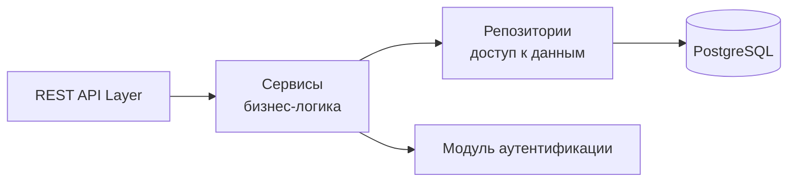
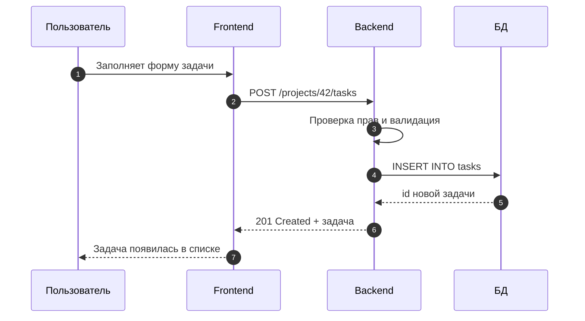

# ТЗ: Бэкенд

Серверная часть демо-проекта «ТаскТрекер».

## Технологический стек

=== "Вариант A (Python)"

    - Язык: **Python 3.12**
    - Фреймворк: **FastAPI**
    - ORM: **SQLAlchemy**
    - Аутентификация: **JWT**

=== "Вариант B (Node.js)"

    - Язык: **TypeScript**
    - Фреймворк: **NestJS**
    - ORM: **Prisma**
    - Аутентификация: **JWT**

## Архитектура



## REST API

Базовый префикс: `/api/v1`. Формат обмена — JSON. Аутентификация — заголовок `Authorization: Bearer <token>`.

| Метод | Путь | Описание | Доступ |
|---|---|---|---|
| `POST` | `/auth/register` | Регистрация | Все |
| `POST` | `/auth/login` | Вход, выдача токена | Все |
| `GET` | `/projects` | Список проектов | Участник |
| `POST` | `/projects` | Создать проект | Участник |
| `GET` | `/projects/{id}/tasks` | Задачи проекта | Участник |
| `POST` | `/projects/{id}/tasks` | Создать задачу | Участник |
| `PATCH` | `/tasks/{id}` | Изменить задачу/статус | Участник |
| `POST` | `/tasks/{id}/comments` | Добавить комментарий | Участник |

### Пример: создание задачи

**Запрос**

```json
POST /api/v1/projects/42/tasks
{
  "title": "Сверстать главную страницу",
  "assignee_id": 7,
  "due_date": "2026-10-15"
}
```

**Ответ** `201 Created`

```json
{
  "id": 1024,
  "title": "Сверстать главную страницу",
  "status": "новая",
  "assignee_id": 7,
  "due_date": "2026-10-15",
  "created_at": "2026-10-01T12:00:00Z"
}
```

## Сценарий «создание задачи»



## Нефункциональные требования

!!! note "Требования к серверу"
    - Ответ API — не медленнее **300 мс** на 95-м перцентиле.
    - Все пароли хранятся только в виде **хэша** (bcrypt).
    - Валидация входных данных на стороне сервера обязательна.
    - Логирование ошибок без персональных данных.

??? tip "Коды ответов API"
    | Код | Значение |
    |---|---|
    | 200 | Успех |
    | 201 | Создано |
    | 400 | Ошибка валидации |
    | 401 | Не авторизован |
    | 403 | Нет прав |
    | 404 | Не найдено |
