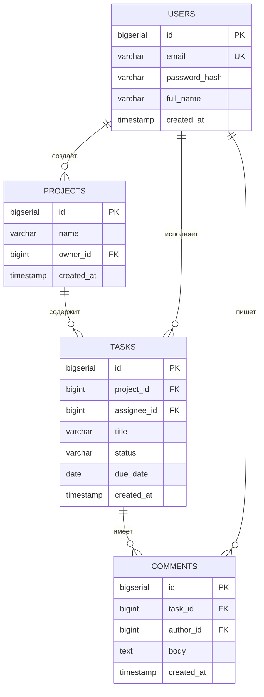

# ТЗ: База данных

Структура хранения данных демо-проекта «ТаскТрекер».

## СУБД

- **PostgreSQL 16**
- Кодировка: `UTF-8`
- Все таблицы имеют суррогатный первичный ключ `id` (`bigserial`).

## ER-диаграмма



## Описание таблиц

### `users` — пользователи

| Поле | Тип | Ограничения |
|---|---|---|
| `id` | bigserial | PK |
| `email` | varchar(255) | UNIQUE, NOT NULL |
| `password_hash` | varchar(255) | NOT NULL |
| `full_name` | varchar(150) | NOT NULL |
| `created_at` | timestamp | DEFAULT now() |

### `projects` — проекты

| Поле | Тип | Ограничения |
|---|---|---|
| `id` | bigserial | PK |
| `name` | varchar(150) | NOT NULL |
| `owner_id` | bigint | FK → users.id |
| `created_at` | timestamp | DEFAULT now() |

### `tasks` — задачи

| Поле | Тип | Ограничения |
|---|---|---|
| `id` | bigserial | PK |
| `project_id` | bigint | FK → projects.id |
| `assignee_id` | bigint | FK → users.id, NULL |
| `title` | varchar(255) | NOT NULL |
| `status` | varchar(20) | DEFAULT 'новая' |
| `due_date` | date | NULL |
| `created_at` | timestamp | DEFAULT now() |

### `comments` — комментарии

| Поле | Тип | Ограничения |
|---|---|---|
| `id` | bigserial | PK |
| `task_id` | bigint | FK → tasks.id |
| `author_id` | bigint | FK → users.id |
| `body` | text | NOT NULL |
| `created_at` | timestamp | DEFAULT now() |

## Индексы

```sql
CREATE INDEX idx_tasks_project ON tasks(project_id);
CREATE INDEX idx_tasks_assignee ON tasks(assignee_id);
CREATE INDEX idx_comments_task ON comments(task_id);
```

!!! note "Правила целостности"
    - Удаление проекта каскадно удаляет его задачи (`ON DELETE CASCADE`).
    - Поле `status` ограничено значениями: `новая`, `в работе`, `на проверке`, `готово`.
    - Email приводится к нижнему регистру перед сохранением.
