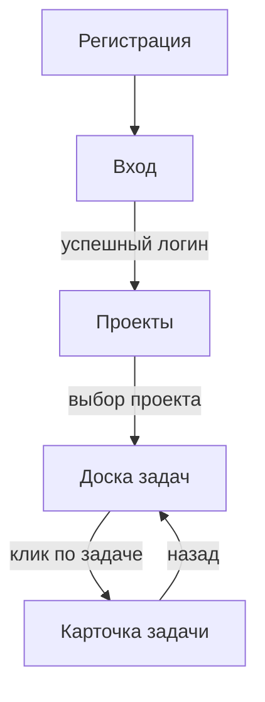

# ТЗ: Фронтенд

Клиентская часть демо-проекта «ТаскТрекер».

## Технологический стек

- Фреймворк: **React 18** + **TypeScript**
- Сборка: **Vite**
- Стили: **Tailwind CSS**
- Состояние: **Redux Toolkit**
- Запросы к API: **RTK Query**

## Экраны приложения

| Экран | Маршрут | Назначение |
|---|---|---|
| Вход | `/login` | Авторизация пользователя |
| Регистрация | `/register` | Создание аккаунта |
| Проекты | `/projects` | Список проектов пользователя |
| Доска задач | `/projects/:id` | Канбан-доска задач проекта |
| Карточка задачи | `/tasks/:id` | Детали задачи и комментарии |

## Навигация



## Доска задач (канбан)

Задачи отображаются колонками по статусам. Перетаскивание карточки между колонками меняет статус задачи (вызов `PATCH /tasks/{id}`).

```
┌──────────┬───────────┬─────────────┬──────────┐
│  Новая   │  В работе │  На проверке │  Готово  │
├──────────┼───────────┼─────────────┼──────────┤
│ [Задача] │ [Задача]  │  [Задача]    │ [Задача] │
│ [Задача] │           │              │ [Задача] │
└──────────┴───────────┴─────────────┴──────────┘
```

## Компоненты

- `Header` — шапка с именем пользователя и кнопкой выхода
- `ProjectCard` — карточка проекта в списке
- `TaskCard` — карточка задачи на доске
- `TaskModal` — модальное окно создания/редактирования задачи
- `CommentList` — список комментариев

## Требования к интерфейсу

!!! note "UX/UI"
    - Адаптивность: корректная работа на экранах от **360 px**.
    - Поддержка **светлой и тёмной** темы.
    - Любое действие с задачей показывает индикатор загрузки.
    - Ошибки API выводятся понятным сообщением, а не кодом.

!!! warning "Безопасность клиента"
    Токен хранится в памяти приложения или `httpOnly`-cookie, **не** в `localStorage` в открытом виде.
