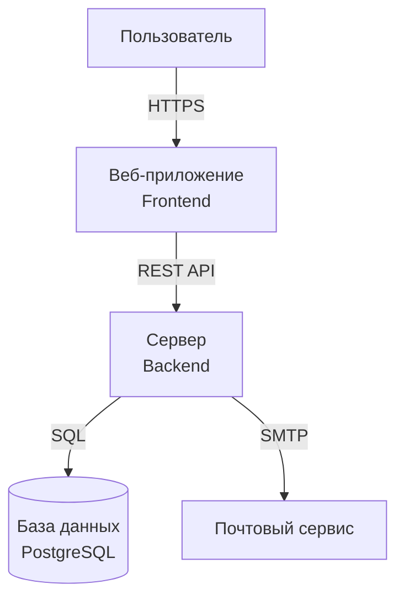

# ТЗ демо-проекта «ТаскТрекер»

!!! warning "Это вымышленный пример"
    Все требования, данные и схемы ниже придуманы для обучения. Проект «ТаскТрекер» не существует.

## Описание проекта

**ТаскТрекер** — веб-сервис для управления задачами внутри небольших команд. Пользователь регистрируется, создаёт проекты, добавляет в них задачи, назначает исполнителей и отслеживает статусы.

### Основные возможности

- Регистрация и вход пользователей
- Создание проектов и задач
- Назначение исполнителя и срока
- Смена статуса задачи: `новая → в работе → на проверке → готово`
- Комментарии к задачам

### Роли пользователей

| Роль | Права |
|---|---|
| Гость | Просмотр публичных проектов |
| Участник | Создание/редактирование своих задач |
| Администратор | Управление проектом и участниками |

## Контекст системы

## Разделы ТЗ

- [Бэкенд](backend.md) — серверная часть, API, логика
- [Фронтенд](frontend.md) — интерфейс, экраны, сценарии
- [База данных](database.md) — структура хранения данных
